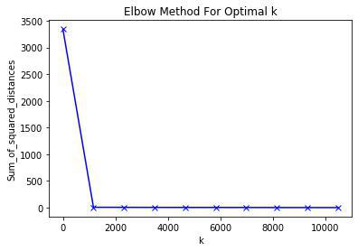

# Classifier using clusters

The project goal is to classify music genre using their lyrics. We chose the naive-bayes classifier as our main algorithm. Nayve-bayes is a statistical algorithm to make predictions based on bayes theorem.

In order to enhance the results achieved by this algorithm a clustering approach was used.

## Clustering Approach

Using word embeddings we were able to clusterize words with their synonyms. This way we reduce the space search and increased words individual probabilitys affecting directly the naive-bayes classifier. 

In this approach we used pre-trained embeddings from Word2Vec. As we know, embedding are sensitive to their context, so our group tried to train our own embedding file using the network.csv and [Node2Vec](https://github.com/aditya-grover/node2vec) algorithm with a few adaptations but we weren't able to finish this trainning due to lack of ram memory. We even tried to reduce the problem dimensionality to train this embeddings but the same issue ocurred;

### K-Means

For this clustering process we used the k-means algorithm. To achieve the best result we have to choose the optimal number of clusters, so we used the elbow method. We ran the k-means for a smaller case with differents values of K. We decided the optimal K when the sum of squared distance leaned to zero. After that, we consider that estimating the value of K for a smaller case we could estimate for the big picture using a linnear aproximation. 

After tunning the params we runned the k-means algorithm again, this time saving the result clusters in a json file, to work as a seed to the new classifiers.

## Next Steps

Due to memory issues we weren't abble to run this algorithms to the full dataset. With that in mind, the next approach will be stop using bag of words and use a process to extract aspects from the music lyrics , cluster this aspects and then re-run the classifiers again, this time with the full dataset.

We could also do a sentiment analysis on this aspects, and use both of this new features on the mlp classifier.
